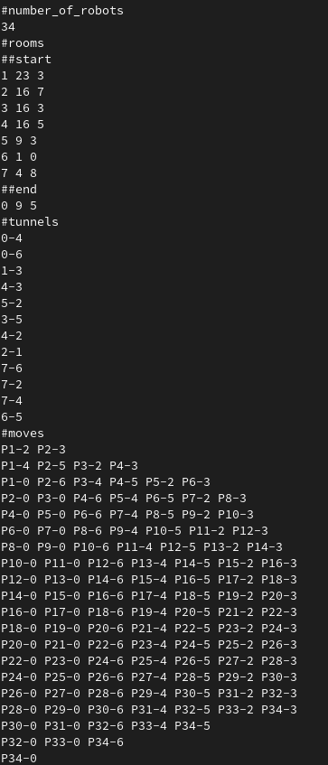

# A-maze-d
###### Module: Elementary Programming B2
## Objectives:
Move the robots from the entrance (start) to the exit (end) in the minimum amount of moves.
The description of the maze is given in the standard input.

<small style="color: indianred;"><em>PD: only one robot per room, if it's occupied the robot have to wait until it's not.</em></small>

## Creation of maze descriptions
Execute the maze generator:
* **size:** number of rooms.
* **density:** percentage of probability of connexions between rooms.
* **nb_of_robots:** number of robots.
```
./laby_gen.pl size density nb_of_robots
```
## Usage:
Execute the following command:

```
./amazed < path_file
```
* **path_file:** the path to the file of the maze description

## Results example:

